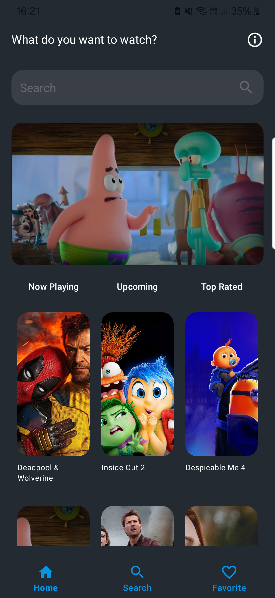
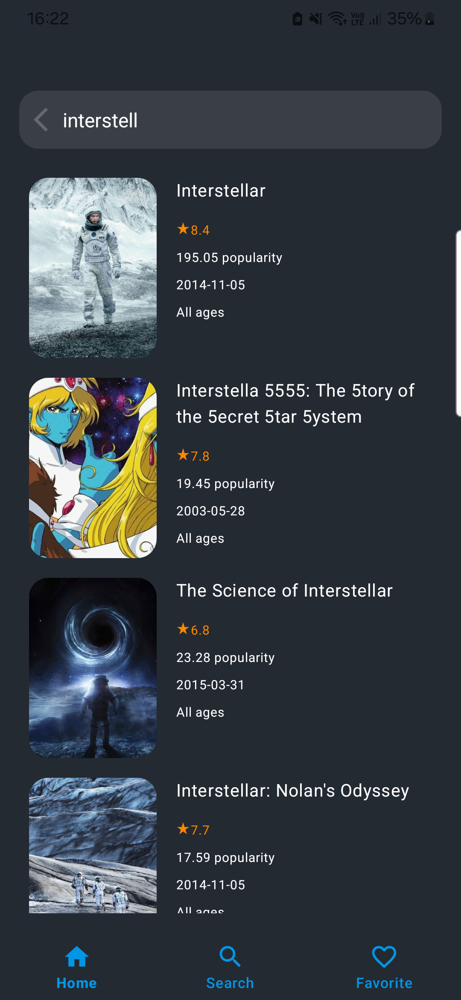
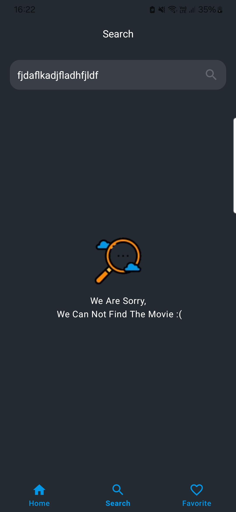
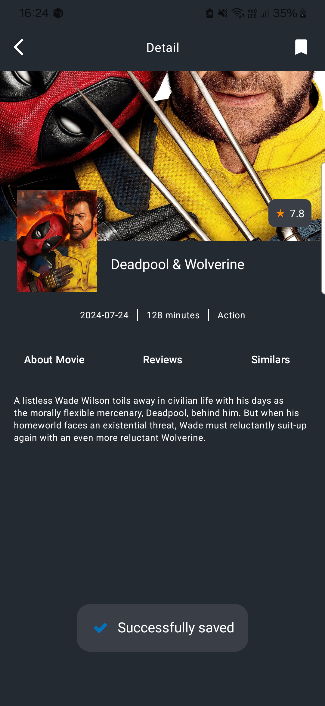
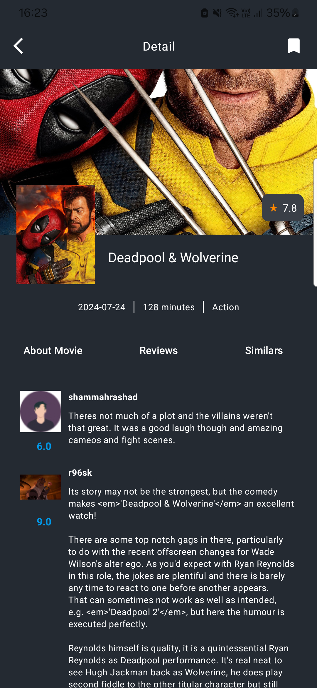
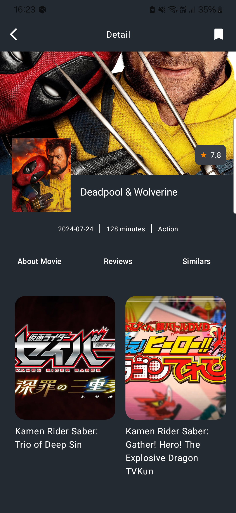
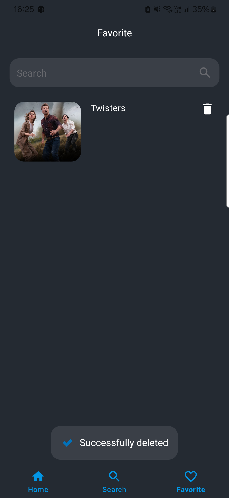
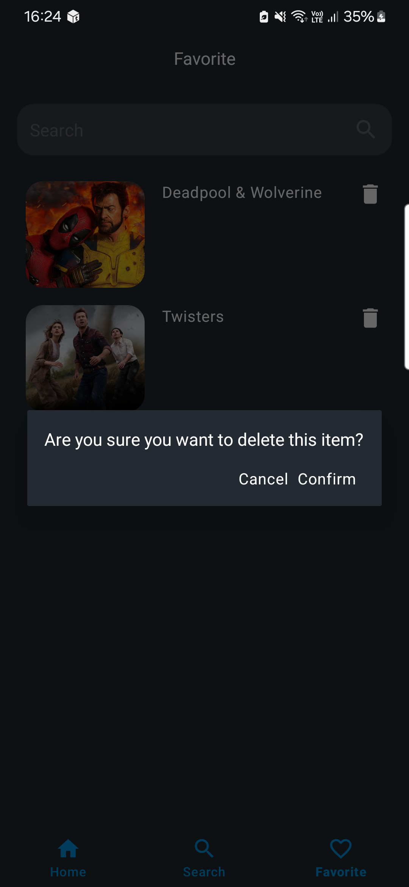

## Used Technologies
- ViewBinding
- Retrofit
- Hilt
- Room
- Coil
- Viewpager
- Pagination
- NavigationComponent

## Folder Structure
- Data
  - Repository
  - Model
  - Source
- Domain
  - ErrorHandling
  - Model
  - Repository
  - UseCase
- Ui
  - Base
  - Components
  - Screens
- Di
- Utils
  - Ext
  - Enums

## Screens

| Home                                                     | HomeSearch                                                      | Search                                                     |
|----------------------------------------------------------|-----------------------------------------------------------------|------------------------------------------------------------|
|  |  |  |

| DetailAbout                                                      | DetailReviews                                                      | DetailSimilars                                                      |
|------------------------------------------------------------------|--------------------------------------------------------------------|---------------------------------------------------------------------|
|  |  |  |

| Favorite                                                     | FavoriteDelete                                                      | 
|--------------------------------------------------------------|---------------------------------------------------------------------|
|  |  |